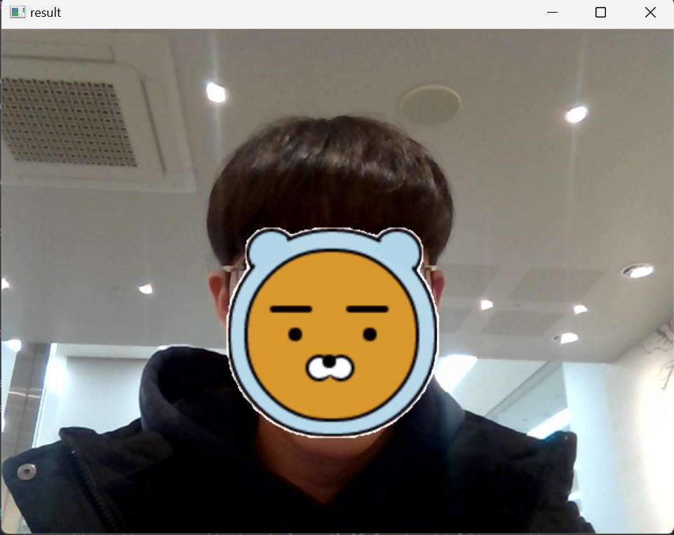

## OPEN SOURCE SOFTWARE
### Trem Project
프로젝트 개요: OpenCV를 활용한 얼굴 필터 제작  
데모 이미지:  
이용한 패키지:  OpenCV, numpy, (dlib, cmake) -> Install Required  
실행 방법:  Pycharm  
참고 자료:  
- https://www.yalco.kr/@git-github/0-1/ (git 참고자료)  
- https://www.youtube.com/watch?v=772uC-_v0hs (OpenCV 참고자료)
- https://www.youtube.com/watch?v=3LNHxezPi1I (OpenCV 참고자료)
- https://github.com/kairess/simple_face_recognition (OpenCV 참고 Proj)
- https://www.youtube.com/watch?v=XK3eU9egll8 (OpenCV 참고자료)
